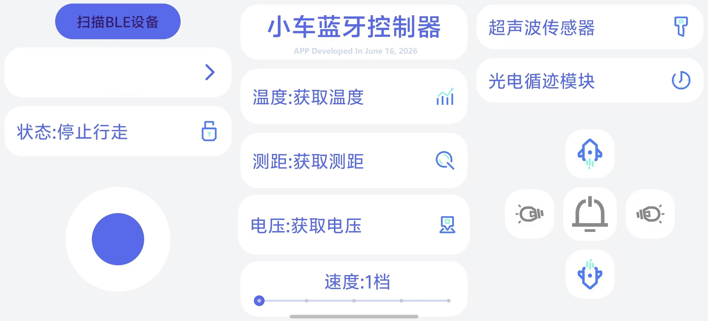

# BLE低功耗蓝牙智能小车安卓控制器
🚕 本项目为BLE蓝牙低功耗智能小车安卓控制APP，适配 Ai-WB2-32S BLE透传模块，替代传统HC05/06串口蓝牙SPP方案，使用GATT特征值读写、Notify被动接收下位机数据。保留原SPP版本全部交互UI与控制逻辑，底层通信完整重构为BLE标准协议，支持安卓12+新版蓝牙动态权限，自动扫描附近BLE设备、一键连接、实时收发小车传感器数据。

<br>
<p align='center'>
  </img>
</p>
<br>

## 核心功能
1. **BLE蓝牙管理**
    - 主动扫描周边BLE设备，自动去重展示设备名+MAC地址
    - 5秒自动停止扫描，支持手动启停扫描
    - GATT长连接管理，页面销毁自动释放蓝牙资源
    - 适配Android 6 ~ Android 15全套蓝牙动态权限
2. **小车运动控制**
    - 四向自定义摇杆：前进/后退/左转/右转/停止
    - 操作锁定开关，锁定后摇杆失效
    - 5档车速调节（加减按钮+滑动条双控）
3. **外设功能控制**
    - 喇叭长按发声、松开关闭
    - 左右转向灯开关切换
    - 超声波测距读取指令
    - 红外循迹模块启停
    - 获取电池电压传感器数据
4. **实时数据回显**
    下位机通过Notify推送12字节固定帧，APP解析展示：
    - 电池电压(mV)
    - 超声波测距(cm)
    - 温度整数+小数位(℃)
5. **用户交互**
    - 所有操作震动反馈
    - 操作弹窗Toast提示
    - 三分栏扁平化圆角UI布局
    - 自定义摇杆第三方控件

## 通信协议说明
### 1. Ai-WB2-32S BLE固定UUID（透传服务）
```java
// 服务UUID
private static final UUID SERVICE_UUID = UUID.fromString("55e405d2-af9f-a98f-e54a-7dfe43535355");
// 写特征值（下发控制指令）
private static final UUID CHAR_WRITE_UUID = UUID.fromString("16962447-c623-61ba-d94b-4d1e43535349");
// Notify通知特征值（接收小车上传传感器数据）
private static final UUID CHAR_NOTIFY_UUID = UUID.fromString("b39b7234-beec-d4a8-f443-418843535349");
// Notify开启描述符标准UUID
00002902-0000-1000-8000-00805f9b34fb
```
> 下发写入使用 `WRITE_TYPE_NO_RESPONSE` 无响应模式，避免BLE频繁断开。

### 2. APP下发控制指令表
#### 单字节指令（外设/速度/传感器）
| 字节 | 功能 |
|------|------|
| 0x01 | 前进 |
| 0x02 | 停止行走 |
| 0x03 | 后退 |
| 0x04 | 右转 |
| 0x05 | 左转 |
| 0x06 | 速度+1档 |
| 0x07 | 速度-1档 |
| 0x08 | 读取超声波测距 |
| 0x09 | 开启红外循迹 |
| 0x10 | 左转向灯切换 |
| 0x11 | 右转向灯切换 |
| 0x12 | 喇叭打开 |
| 0x13 | 喇叭关闭 |
| 0x14 | 读取电池电压 |

#### 摇杆运动字符指令（BLE新版修改）
| 字符 | 功能 |
|------|------|
| G | 前进 |
| B | 后退 |
| L | 左转 |
| R | 右转 |
| P | 停止 |

### 3. 下位机上传数据帧格式（固定12字节）
下位机主动Notify推送12字节数据包，APP按索引分段解析字符：
1. `byte[0]~byte[3]`：电压字符串，拼接后单位mV
2. `byte[4]~byte[7]`：超声波测距字符串，拼接后单位cm
3. `byte[8]~byte[9]`：温度整数部分
4. `byte[10]~byte[11]`：温度小数部分

## 项目文件结构
```
com.example.car_control
└── MainActivity.java          // 主逻辑、BLE扫描/GATT通信、UI交互、数据解析
res/layout/
├── activity_main.xml          // 主页面三分栏布局（新增BLE扫描按钮）
└── spinner_res.xml            // BLE设备下拉列表单项样式
```

## 代码模块详解
### 1. BLE扫描模块 ScanCallback
- 扫描周边BLE广播设备，自动去重，存入设备列表
- 设备名+MAC地址展示在Spinner下拉框
- 5秒自动停止扫描，避免持续耗电

### 2. BLE GATT连接回调 BluetoothGattCallback
完整BLE连接流程：
1. 设备连接成功 → 自动发现服务 `discoverServices()`
2. 匹配透传Service UUID，获取写特征、通知特征
3. 开启Notify通知，写入0x2902描述符启用数据推送
4. `onCharacteristicChanged` 监听下位机上传数据，通过Handler抛到主线程更新UI
5. 断开时自动释放Gatt资源，置空通信特征对象

### 3. 统一BLE发送封装 sendBleData()
全局统一发送接口，替换原SPP `outputStream.write`：
- 前置判断BLE连接状态，未连接弹窗提示
- 设置无响应写入模式，适配WB2模块稳定通信
- 封装单字节数组下发，所有按钮/摇杆共用此方法

### 4. 权限处理 requestBlePermission()
分安卓版本动态申请蓝牙权限：
- Android 12+ (SDK31+)：`BLUETOOTH_SCAN`、`BLUETOOTH_CONNECT`
- Android 11及以下：`ACCESS_FINE_LOCATION` 定位权限
- 基础权限：BLUETOOTH、BLUETOOTH_ADMIN

### 5. UI布局 activity_main.xml
采用 `TableLayout` 横向三等分LinearLayout布局：
1. **左栏（控制区）**
    - BLE扫描按钮、设备选择下拉框、连接按钮
    - 操作锁定状态文字、自定义四向摇杆
2. **中间栏（数据显示区）**
    - APP标题、版本文字
    - 温度、测距、电压数据展示模块
    - 速度档位文字+滑动调速条
3. **右栏（外设快捷按键）**
    - 超声波、红外循迹功能按钮
    - 加减速上下箭头、喇叭长按按钮、左右转向灯图标

### 6. 数据解析Handler
复用原有解析逻辑，接收Notify推送的12字节数组，分段拼接字符串刷新TextView，实时展示小车传感器数据。

## 使用操作步骤
### 前置准备
1. Android Studio 编译，最低支持Android P (API28)
2. 下位机搭载 Ai-WB2-32S BLE透传模块，匹配项目内UUID
3. 下位机通信协议对齐：下发单字节/字符指令、上传12字节传感器帧

### APP操作流程
1. 打开APP，自动申请蓝牙相关权限，自动开启蓝牙
2. 点击【扫描BLE设备】，5秒自动扫描周边蓝牙模块
3. 下拉Spinner选中目标小车BLE设备，点击右侧连接图标建立GATT连接
4. 左侧摇杆控制小车前进、后退、转向；顶部文字点击锁定/解锁摇杆操作
5. 中间滑动条或上下箭头调节行驶速度（1~5档）
6. 右侧功能按钮控制：喇叭、转向灯、超声波、红外循迹、读取电压
7. 中间区域实时刷新小车上传的电压、测距、温度数据
8. 退出APP自动断开BLE连接，释放蓝牙资源

## 生命周期资源释放
重写 `onDestroy()` 完成资源回收，避免蓝牙后台常驻耗电、内存泄漏：
1. 停止BLE扫描
2. 断开GATT连接
3. 关闭BluetoothGatt并置空全局对象

## 现存缺陷与优化建议
### 当前问题
1. 无BLE断线自动重连逻辑，断开后需手动重新扫描连接
2. 无数据包校验头/校验和，脏数据会造成UI乱码
3. 扫描未做超时容错，极端场景可能扫描卡死
4. 未做后台保活，APP切后台后BLE连接易被系统回收
5. 数值仅做字符串拼接，无数字转换、异常数据过滤

### 优化方向
1. 增加断线监听，弹窗提示并提供一键重连
2. 自定义通信帧头+校验和，过滤无效脏数据包
3. 增加BLE扫描超时、异常捕获容错逻辑
4. 增加前台服务保活BLE长连接
5. 字符串转数字解析，增加数值范围判断，防止UI乱码
6. 增加日志打印工具类，替换原生异常打印，方便调试

## 开发信息
- 开发日期：2026年06月16日
- 通信方式：BLE 低功耗蓝牙 GATT透传
- 适配硬件：Ai-WB2-32S BLE模块
- 第三方摇杆库： `MyRockerView` @y141111
- 图标素材： `双色线性ICON` @Konan君